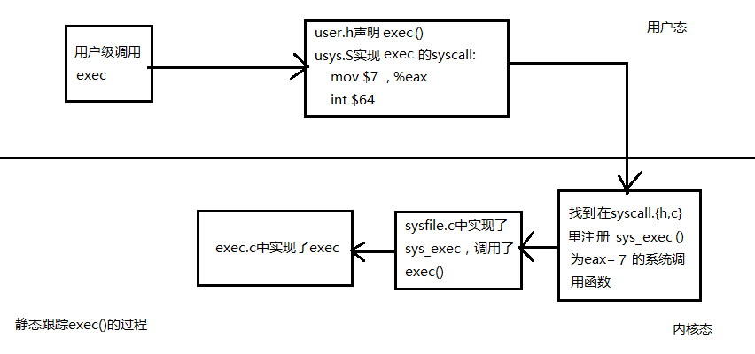

# Lab 2 Report

### Tasks
1. Process overview     
At least include process abstraction and address space. Understand the kernel organization and resources abstraction in xv6.     

2. The first process     
Include creating and running the first process. main calls userinit to create the first process (pid=1), and userinit calls allocproc to create a slot ( struct proc ) in the process table and initializes the process. The proc struct is important, please do understand and analysis mainly `p->context , p->kstack , p->tf , p->pgdir` .     
3. The first system call exec     
Understand the system call invoking and processing procedure in xv6. Trace the code and give necessary analysis and comments. You can also trace other system calls, such as fork.     

### Process overview
XV6 maintains different pages for each process to decouple the memory space and the physical memory to provide more flexibility to the program. And this is a picture of the virtual memory space map in the xv6.     


And for each process xv6 will maintain the status of the process using `struct proc`. In the c structure, it stores the running status of the process like stacks and trapframe. In proc.h we can find its definition:

```c
// Per-process state
struct proc {
  uint sz;                     // Size of process memory (bytes)
  pde_t* pgdir;                // Page table
  char *kstack;                // Bottom of kernel stack for this process
  enum procstate state;        // Process state
  int pid;                     // Process ID
  struct proc *parent;         // Parent process
  struct trapframe *tf;        // Trap frame for current syscall
  struct context *context;     // swtch() here to run process
  void *chan;                  // If non-zero, sleeping on chan
  int killed;                  // If non-zero, have been killed
  struct file *ofile[NOFILE];  // Open files
  struct inode *cwd;           // Current directory
  char name[16];               // Process name (debugging)
};
```

The `context` stores the values of registers. The `kstack` points to the reserved kernel stack space address. The `trapframe` saves the current frame. And `pgdir` points to the page table of the process.

### The first process
By `userinit`, the kernel calls `allocproc`, which is a function that find and allocate a empty process slot for the new process, which is also called by fork, and initialize the process state to prepare to run the process. The `allocproc` find an empty slot and set the process state from UNUSED to EMBRYO, and set the kernel stack properly. It also make the memory map and the trapframe, then set the state to RUNNABLE. Then it calls the sheduler to run this process.

### Tracing exec()
My Tracing Procedure In a Diagram:


By setting the eax and triggering an interrupt we successfully make the syscall exec.
So we are finally in exec.c.
In the exec(), the kernel read the elf file and load the program into memory, then switchuvm to run it.