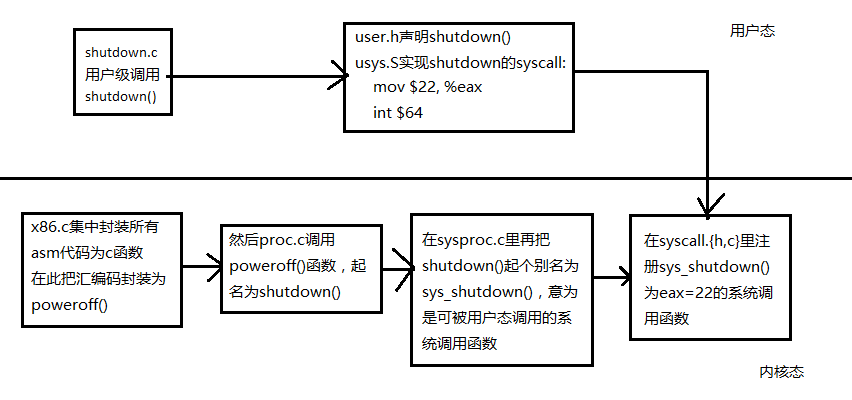
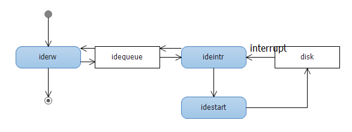

# lab4 report

## Tasks

1. What’s the difference of system calls, interrupts and exceptions in xv6? Explain
them with specific code.
2. Go deep into the design and implementation of system calls. Explain the system
call invoking and handling procedure. And explain the stack changes during the
procedure. You can use a system call example except exec for illustration.
3. Implement a new system call.
4. Understand and analyze the disk driver implementation.

## Differences between them

Interrupt is a mechanism that allows OS to handle external events. It can be triggered by a hardware, software or a special instruction named `int` in x86. When it is triggered, CPU will interrupt and handle the interrupt by calling corresponding handler function, for example in xv6, just like the table shown below:

```c
static int (*syscalls[])(void) = {
[SYS_fork]    sys_fork,
[SYS_exit]    sys_exit,
[SYS_wait]    sys_wait,
[SYS_pipe]    sys_pipe,
[SYS_read]    sys_read,
[SYS_kill]    sys_kill,
[SYS_exec]    sys_exec,
[SYS_fstat]   sys_fstat,
[SYS_chdir]   sys_chdir,
[SYS_dup]     sys_dup,
[SYS_getpid]  sys_getpid,
[SYS_sbrk]    sys_sbrk,
[SYS_sleep]   sys_sleep,
[SYS_uptime]  sys_uptime,
[SYS_open]    sys_open,
[SYS_write]   sys_write,
[SYS_mknod]   sys_mknod,
[SYS_unlink]  sys_unlink,
[SYS_link]    sys_link,
[SYS_mkdir]   sys_mkdir,
[SYS_close]   sys_close,
[SYS_shutdown] sys_shutdown
};
```

So system call is a special kind of interrupt instruction called by user program or system API like `exec`. And exception is interrupt triggered by illegal instrcution in user mode like zero division.

## System call

### My shutdown implementation

I implement the `shutdown` system call and here is the code:

```c
Makefile
 @@ -159,6 +159,7 @@ mkfs: mkfs.c fs.h
  UPROGS=\
  	_cat\
  	_echo\
 +	_exit\
  	_forktest\
  	_grep\
  	_init\

defs.h
 @@ -118,6 +118,7 @@ void            userinit(void);
  int             wait(void);
  void            wakeup(void*);
  void            yield(void);
 +int             shutdown(void);
  
  // swtch.S
  void            swtch(struct context**, struct context*);

exit.c
@@ -0,0 +1,7 @@
 +#include "types.h"
 +#include "user.h"
 +
 +int main() {
 +	shutdown();
 +	return 0;
 +}

proc.c
 @@ -464,3 +464,9 @@ procdump(void)
      cprintf("\n");
    }
  }
 +
 +int
 +shutdown(void)
 +{
 +	return poweroff();
 +}

syscall.c
 @@ -98,6 +98,7 @@ extern int sys_unlink(void);
  extern int sys_wait(void);
  extern int sys_write(void);
  extern int sys_uptime(void);
 +extern int sys_shutdown(void);
  
  static int (*syscalls[])(void) = {
  [SYS_fork]    sys_fork,
 @@ -121,6 +122,7 @@ static int (*syscalls[])(void) = {
  [SYS_link]    sys_link,
  [SYS_mkdir]   sys_mkdir,
  [SYS_close]   sys_close,
 +[SYS_shutdown] sys_shutdown
  };

syscall.h
 @@ -20,3 +20,4 @@
  #define SYS_link   19
  #define SYS_mkdir  20
  #define SYS_close  21
 +#define SYS_shutdown 22

sysproc.c
 @@ -89,3 +89,9 @@ sys_uptime(void)
    release(&tickslock);
    return xticks;
  }
 +
 +int
 +sys_shutdown(void)
 +{
 +        return shutdown();
 +}

user.h	
 @@ -23,6 +23,7 @@ int getpid(void);
  char* sbrk(int);
  int sleep(int);
  int uptime(void);
 +int shutdown(void);
  
  // ulib.c
  int stat(char*, struct stat*);

usys.S
 @@ -29,3 +29,4 @@ SYSCALL(getpid)
  SYSCALL(sbrk)
  SYSCALL(sleep)
  SYSCALL(uptime)
 +SYSCALL(shutdown)

x86.h
 @@ -144,6 +144,30 @@ lcr3(uint val)
    asm volatile("movl %0,%%cr3" : : "r" (val));
  }
  
 +static inline int
 +poweroff(void)
 +{
 +	asm("movl $0x80000b80, %eax\n"
 +	"movw $0xcf8, %dx\n"
 +	"outl  %eax, %dx\n"
 +	"movw $0xcfc, %dx\n"
 +	"inb  %dx, %al\n"
 +	"orb  $1, %al\n"
 +	"outb  %al, %dx\n"
 +	"\n"
 +	"movl $0x80000b40, %eax\n"
 +	"movw $0xcf8, %dx\n"
 +	"outl  %eax, %dx\n"
 +	"movl $0x7001, %eax\n"
 +	"movw $0xcfc, %dx\n"
 +	"outl  %eax, %dx\n"
 +	"movw $0x2000, %ax\n"
 +	"movw $0x7004, %dx\n"
 +	"outw  %ax, %dx\n");
 +
 +	return 0;
 +}
 +

```

### System call invoking and handling

To illustrate the procedure of implementing and calling `shutdown()`, I used a diagram shown previously.



And the handler is here:

```c
void
trap(struct trapframe *tf)
{
  if(tf->trapno == T_SYSCALL){
    if(proc->killed)
      exit();
    proc->tf = tf;
    syscall();
    if(proc->killed)
      exit();
    return;
  }

  switch(tf->trapno){
  case T_IRQ0 + IRQ_TIMER:
    if(cpu->id == 0){
      acquire(&tickslock);
      ticks++;
      wakeup(&ticks);
      release(&tickslock);
    }
    lapiceoi();
    break;
  case T_IRQ0 + IRQ_IDE:
    ideintr();
    lapiceoi();
    break;
  case T_IRQ0 + IRQ_IDE+1:
    // Bochs generates spurious IDE1 interrupts.
    break;
  case T_IRQ0 + IRQ_KBD:
    kbdintr();
    lapiceoi();
    break;
  case T_IRQ0 + IRQ_COM1:
    uartintr();
    lapiceoi();
    break;
  case T_IRQ0 + 7:
  case T_IRQ0 + IRQ_SPURIOUS:
    cprintf("cpu%d: spurious interrupt at %x:%x\n",
            cpu->id, tf->cs, tf->eip);
    lapiceoi();
    break;
   
  //PAGEBREAK: 13
  default:
    if(proc == 0 || (tf->cs&3) == 0){
      // In kernel, it must be our mistake.
      cprintf("unexpected trap %d from cpu %d eip %x (cr2=0x%x)\n",
              tf->trapno, cpu->id, tf->eip, rcr2());
      panic("trap");
    }
    // In user space, assume process misbehaved.
    cprintf("pid %d %s: trap %d err %d on cpu %d "
            "eip 0x%x addr 0x%x--kill proc\n",
            proc->pid, proc->name, tf->trapno, tf->err, cpu->id, tf->eip, 
            rcr2());
    proc->killed = 1;
  }

  // Force process exit if it has been killed and is in user space.
  // (If it is still executing in the kernel, let it keep running 
  // until it gets to the regular system call return.)
  if(proc && proc->killed && (tf->cs&3) == DPL_USER)
    exit();

  // Force process to give up CPU on clock tick.
  // If interrupts were on while locks held, would need to check nlock.
  if(proc && proc->state == RUNNING && tf->trapno == T_IRQ0+IRQ_TIMER)
    yield();

  // Check if the process has been killed since we yielded
  if(proc && proc->killed && (tf->cs&3) == DPL_USER)
    exit();
}

void
syscall(void)
{
  int num;

  num = proc->tf->eax;
  if(num > 0 && num < NELEM(syscalls) && syscalls[num]) {
    proc->tf->eax = syscalls[num]();
  } else {
    cprintf("%d %s: unknown sys call %d\n",
            proc->pid, proc->name, num);
    proc->tf->eax = -1;
  }
}
```

Passing eax as a parameter to indicate which system call to call.

#### stack changes

From the diagram we can know that, when `int $64` is called, program will switch to kernel mode and user stack is switched to kernal stack. When the handler function returns, `trapret()` is called and stack is switched to user stack and user program continues to run.

## disk driver implementation

The implementation is in ide.c.

First, in ideinit() called at boot time:

```c
void
ideinit(void)
{
  int i;
  
  initlock(&idelock, "ide");
  picenable(IRQ_IDE);
  ioapicenable(IRQ_IDE, ncpu - 1);
  idewait(0);
  
  // Check if disk 1 is present
  outb(0x1f6, 0xe0 | (1<<4));
  for(i=0; i<1000; i++){
    if(inb(0x1f7) != 0){
      havedisk1 = 1;
      break;
    }
  }
  
  // Switch back to disk 0.
  outb(0x1f6, 0xe0 | (0<<4));
}
```

This function enables the related IDE interrupts. Then check how many disks the system have.

```c
// Wait for IDE disk to become ready.
static int
idewait(int checkerr)
{
  int r;

  while(((r = inb(0x1f7)) & (IDE_BSY|IDE_DRDY)) != IDE_DRDY) 
    ;
  if(checkerr && (r & (IDE_DF|IDE_ERR)) != 0)
    return -1;
  return 0;
}
```

`idewait()` is a function that used to busy waiting for the ide disk to be ready to accept command.

```c
// Sync buf with disk. 
// If B_DIRTY is set, write buf to disk, clear B_DIRTY, set B_VALID.
// Else if B_VALID is not set, read buf from disk, set B_VALID.
void
iderw(struct buf *b)
{
  struct buf **pp;

  if(!(b->flags & B_BUSY))
    panic("iderw: buf not busy");
  if((b->flags & (B_VALID|B_DIRTY)) == B_VALID)
    panic("iderw: nothing to do");
  if(b->dev != 0 && !havedisk1)
    panic("iderw: ide disk 1 not present");

  acquire(&idelock);  //DOC:acquire-lock

  // Append b to idequeue.
  b->qnext = 0;
  for(pp=&idequeue; *pp; pp=&(*pp)->qnext)  //DOC:insert-queue
    ;
  *pp = b;
  
  // Start disk if necessary.
  if(idequeue == b)
    idestart(b);
  
  // Wait for request to finish.
  while((b->flags & (B_VALID|B_DIRTY)) != B_VALID){
    sleep(b, &idelock);
  }

  release(&idelock);
}
```

Put IO operation into the idequeue and wait for finish by calling `iderw()`.

And the handler of IO interrupt is:

```c

// Interrupt handler.
void
ideintr(void)
{
  struct buf *b;

  // First queued buffer is the active request.
  acquire(&idelock);
  if((b = idequeue) == 0){
    release(&idelock);
    // cprintf("spurious IDE interrupt\n");
    return;
  }
  idequeue = b->qnext;

  // Read data if needed.
  if(!(b->flags & B_DIRTY) && idewait(1) >= 0)
    insl(0x1f0, b->data, BSIZE/4);
  
  // Wake process waiting for this buf.
  b->flags |= B_VALID;
  b->flags &= ~B_DIRTY;
  wakeup(b);
  
  // Start disk on next buf in queue.
  if(idequeue != 0)
    idestart(idequeue);

  release(&idelock);
}
```

The handler once receive the interrupt, it set the flags to tell the process that the request is finished and wake it up, then start the next request in the idequeue. And the worker function `idestart()` is here:

```c
// Start the request for b.  Caller must hold idelock.
static void
idestart(struct buf *b)
{
  if(b == 0)
    panic("idestart");
  if(b->blockno >= FSSIZE)
    panic("incorrect blockno");
  int sector_per_block =  BSIZE/SECTOR_SIZE;
  int sector = b->blockno * sector_per_block;

  if (sector_per_block > 7) panic("idestart");
  
  idewait(0);
  outb(0x3f6, 0);  // generate interrupt
  outb(0x1f2, sector_per_block);  // number of sectors
  outb(0x1f3, sector & 0xff);
  outb(0x1f4, (sector >> 8) & 0xff);
  outb(0x1f5, (sector >> 16) & 0xff);
  outb(0x1f6, 0xe0 | ((b->dev&1)<<4) | ((sector>>24)&0x0f));
  if(b->flags & B_DIRTY){
    outb(0x1f7, IDE_CMD_WRITE);
    outsl(0x1f0, b->data, BSIZE/4);
  } else {
    outb(0x1f7, IDE_CMD_READ);
  }
}

```

It set up the parameter ports according to pointer b.

### Conclusion

Here is the diagram of disk driver.

