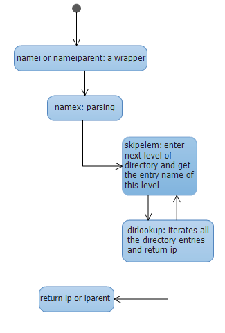

# lab7 report

## Tasks

File path parsing

## Steps

To analyze the file name parsing procedure, just have a look at the exec function to see how it parsing the file name.     

In exec.c:
```c
int
exec(char *path, char **argv)
{
  char *s, *last;
  int i, off;
  uint argc, sz, sp, ustack[3+MAXARG+1];
  struct elfhdr elf;
  struct inode *ip;
  struct proghdr ph;
  pde_t *pgdir, *oldpgdir;

  begin_op();
  if((ip = namei(path)) == 0){
    end_op();
    return -1;
  }
  ilock(ip);
  pgdir = 0;

  // Check ELF header
  if(readi(ip, (char*)&elf, 0, sizeof(elf)) < sizeof(elf))
    goto bad;
```

From the above code segment, we can know that `namei(path)` is the function to parse the file name and get the inode pointer. So, just find the usage of that function.

```c
static struct inode*
namex(char *path, int nameiparent, char *name)
{
  struct inode *ip, *next;

  if(*path == '/')
    ip = iget(ROOTDEV, ROOTINO);
  else
    ip = idup(proc->cwd);

  while((path = skipelem(path, name)) != 0){
    ilock(ip);
    if(ip->type != T_DIR){
      iunlockput(ip);
      return 0;
    }
    if(nameiparent && *path == '\0'){
      // Stop one level early.
      iunlock(ip);
      return ip;
    }
    if((next = dirlookup(ip, name, 0)) == 0){
      iunlockput(ip);
      return 0;
    }
    iunlockput(ip);
    ip = next;
  }
  if(nameiparent){
    iput(ip);
    return 0;
  }
  return ip;
}

struct inode*
namei(char *path)
{
  char name[DIRSIZ];
  return namex(path, 0, name);
}

struct inode*
nameiparent(char *path, char *name)
{
  return namex(path, 1, name);
}
```

So, now we know that `namei()` is the function to parse the file name and `nameiparent()` is to parse the parent directory of the file, where `skipelem()` is defined as:

```
// Examples:
571	//   skipelem("a/bb/c", name) = "bb/c", setting name = "a"
572	//   skipelem("///a//bb", name) = "bb", setting name = "a"
573	//   skipelem("a", name) = "", setting name = "a"
```

In fact, to parse the file name, xv6 iterates the entries of current working directory to find a file, go into corresponding entry, and repeat recursively until found or not found. To do a `dirlookup()` below, xv6 calls `readi()` to read the inode and compare the name and the name of directory entries. Finally, calling `iget()` to get it.

```c
// Look for a directory entry in a directory.
// If found, set *poff to byte offset of entry.
struct inode*
dirlookup(struct inode *dp, char *name, uint *poff)
{
  uint off, inum;
  struct dirent de;

  if(dp->type != T_DIR)
    panic("dirlookup not DIR");

  for(off = 0; off < dp->size; off += sizeof(de)){
    if(readi(dp, (char*)&de, off, sizeof(de)) != sizeof(de))
      panic("dirlink read");
    if(de.inum == 0)
      continue;
    if(namecmp(name, de.name) == 0){
      // entry matches path element
      if(poff)
        *poff = off;
      inum = de.inum;
      return iget(dp->dev, inum);
    }
  }

  return 0;
}
```

## Conclusion

The algorithm is shown below.




